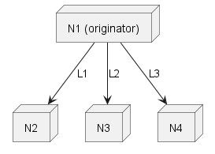
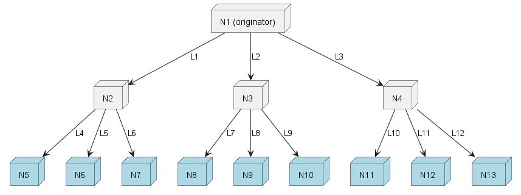

#ChipNet Distributed Graph Search

## Overview

Route discovery finds one or more paths connecting nodes, via intermediate directional links, in a network.  Directly linked nodes share communication and can send messages in either direction between themselves, whereas transitive links must remain anonymous.

There are two general types of discovery:

* Unidirectional – Finds a target node, starting from an origin node
* Bidirectional – Finds a path from one node to another, working in both directions.  These endpoints may be the same node also.

### Unidirectional search

The unidirectional query algorithm proceeds as follows:
1. Starting at originator, queries the self participant.
2. On first search, a participant searches itself and all known peers for a target match.  
     * If match is found, it is returned, and local context is updated;
     * If no match, a set of potential candidates are collected and stored in local context;
3. Originator gets results.
     * If originator receives one or more match, returns them - done.
     * If no matches, reenter query on local participant
4. Participant resumes context by the session code and queries on all candidates.
5. Repeats until maximum depth is reached or match is found

Notes:
* Each node gives it's partners a finite time to execute.  If a response isn't received by the end of the step, a response will be given, excluding the result of the outstanding request.  During the next query, any outstanding responses from the prior step are folded in.
* The links of the path in the plan are built on the way out (to avoids cycles), the participant information is filled in on the way back (maximizes privacy).

## Concepts

### Address

The target address is opaque to this protocol.  Note that various address scenarios are possible:
* *Indirect* – discovery by finding a node that "knows" of the node.  This is efficient, because search doesn't have to progress to the node itself.
* *Direct or Hidden* – search proceeds to the node itself.  This might be useful if the node itself needs to approve the request, or for maximum anonymity.
* *Anonymized indirect* – The target node provides to the originator the session ID and an anonymizing nonce, which allows a peer to recognize that target, but protects the fixed address.

### Participant

A participant is a node through which we are attempting to discover a path.  There are the following types of participants:
* **Originator** - The participant initiating the discovery
* **Intermediate** - A regular participant
* **Terminus** - The intended target of discovery

### Link

A link is a directed edge (e.g. tally in MyCHIPs), between nodes.  Note that in general there may be multiple links that lead to and from the same participant node.  _Link_ refers to a trade/trust link, not specifically a communications link, though it does imply that a communications link can be established.

### Session Code

Each query has a Session Code, which is a cryptographically random salt used to generate the hashed nonce, which acts as a surrogate identifier for participants in the session.  See [ChipCode](https://github.com/gotchoices/ChipCode) for details on CryptoHashes.  The Session Code essentially provides the following:
* A distributed unique identifier for the query
* A cryptographic salt for hashing private identifiers (allowing tally IDs to remain deterministic, but anonymous) - see Nonces
* A query lifetime (via expiration), allowing parties to safely release query-related resources afterward

### Nonce

A nonce, for the purpose of this library, is an anonymized (hashed and salted) link identifier.  Using a Nonce and the Session Code, a party can verify the identity of an already known identifier, but the Nonce and Session Codes don't otherwise disclose the identity.  The nonce is produced by getting the base64 encoding of the SHA-256 hash of the link prepended to the Session Code.  See the [ChipCode](https://github.com/gotchoices/ChipCode) library for details.

### Query

A node query (`QueryRequest`) is either first-time, or reentrant.  

For first-time queries:
* **Verify Session Code** is unique - history kept in state within expiration window
* **Search made** locally based on the current nodes secret and public identities, as well as known peer identities
* **State stored** for the query (whether found or not), so further queries can be rejected or resumed
* **Candidates stored** to state if no matches are found for next depth if needed

Reentrant queries are resumed by the session code in order to search another level deep:
* **Session Code expiration** validated 
* **Late-responding requests** inspected in case they already contain results
* **Sub-node candidates queried** 
* **State is updated** when all responses are in, or the time budget is up
* **Results are returned**

## Step Sequence Timing

Note: Partly implemented

Details can be found in [Time Sync via THIST](doc/time-sync)
Timing is carefully orchestrated during the route discovery process. With each depth level represents a query sequence.  The querying participant waits for responses based on a combination of factors:
* **All responses** - If all responses are in, this overrides the time budget, and a response is immediately made
* **Time budget** - Each node is given a fixed budget by the requester, which includes the subtraction of the previously measured round-trip delay time.  When this elapses, regardless of number of respondents, the sequence is over and a responses is given
* If a **late response** arrives after a sequence completes, it will be included in the next sequence, if there is one.

## Query economics

**Note:** for discussion - mostly not implemented

The total cost of a query is determined by the aggregate number of nodes searched.  Every node is incentivized to keep costs to a minimum because high-cost queries will degrade future standing.
* The cumulative cost associated with sub-links is kept by each node, and aggregated back up the query.
* For nodes with high fan-outs, accumulated costs from prior queries are used to prioritize sub-links to reduce effective fan-out.
* Maximum fan-out is determined by cumulative cost of incoming query node
* For a node with trimmed fan-out, de-prioritized sub-links are treated like nodes at a deeper level.  For instance, if a node has 1,000 sub-links and a max fan-out of 100, the first level query (relative to the node) will only propagate to the 100 sub-links with the lowest cumulative costs.  When the node receives the next query for a level deeper, it queries the next level with the prior 100 sub-links, but may query first level with the rest of the nodes.
* A node can choose to penalize a disproportionately high cost sub-link, but skipping one or more propagations
* Sub-nodes also account for query costs against their up-stream (querying) nodes.  This disincentivizes up-stream nodes from performing any more queries than necessary.

This scheme avoids a pile-on effect for successful paths, favoring diversity of pathways, and disincentivizes over-searching.

TODO:
* Give "cumulative cost" a better name.  Score?  Effort?

## Pathologies

* Too deep - a node attempts to query above agreed upon thresholds
  * Incentives - allows the node to discover pathways despite extreme aggregate expense
  * Disincentives - accumulates cost
  * Mitigations:
    * [x] All nodes check for max depth.  Sub-links will fail one-level deeper
    * [ ] All nodes have a max-cost cut-off.
* Too wide - a node fans out extremely widely, resulting in large numbers of queried nodes for every received query.  This is actually okay from a self-search (first level) perspective, but undesirable in terms of propagation.
  * Incentives - results in more successes
  * Disincentives:
    * increases costs - slows future searching
    * 
* Unsatisfied originator - A root node receives one or more valid paths from one or more sub-links, but continues searching deeper on sub-links where a match wasn't found.
  * Incentives - this could give an Originator "more options" to choose from to complete the transaction.
  * Disincentives:
    * accumulates more cost against originator
    * additional paths would be deeper than already discovered ones
    * takes more time
  * Mitigations:
    * [x] Maximum depth will be eventually reached, and is checked by all nodes
* Statistics hiding - not disclosing the true accumulation of stats from sub-queries
  * Incentives - Reduces apparent costs
  * Mitigations:
    * [ ] Perhaps the cost associated with a successful result is based on an assumed cost per path depth, rather than reported statistics.
* Not de-prioritizing based on cumulative costs
  * Disincentives - accumulates high costs against small pool of sub-nodes
* Lazy nodes - don't search or propagate requests
  * Incentives - minimizes resource expenditures
  * Disincentives - does not accomplish transactions
* Denial of service - unnecessary queries
  * Disincentives - accumulates costs uselessly
