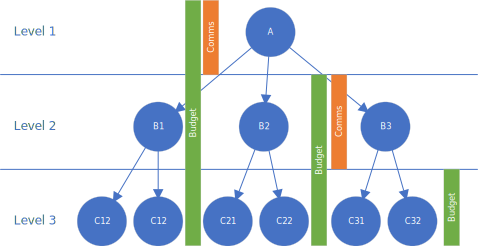
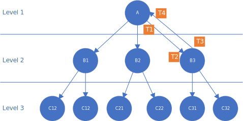

# THIST - Thresholded HIstogram Sub-timing 
## Time Synchronization of Distributed Depth First Traversal

DRAFT: This is a design concept and has not yet been implemented

Depth First Traversal entails synchonizing many parallel search paths.  There are several reasons to carefully synchronize the timing of the traversal:
* If the parallel search paths are not synchronized, a certain unfairness unfolds, where nodes who respond slowly (for reasons of network, processing, or otherwise) are allowed to slip behind in depth levels, thus penalizing faster nodes with increased burden.
* As depth increases, timing differences accumulate, and since the number of nodes exponentially increases with depth, the vast majority of nodes are also the most out of sync.

Optimal fairness would be acheived if unlimited time was given to each sub-query, such that all sub-queries would resolve to completion before beginning the next level.  This is not practical because:
* Faults may result in some sub-queries never completing at all
* Pure fairness regresses to lowest common denominator performance

To optimize towards fairness, without degenerating to lowest common denominator performance, THIST takes the following high-level approach:
* For each time a node recurses to sub-queries, a leaf-node response-time histogram is kept
* Histograms from sub-queries are aggregated across sub-queries, adding in the processing and one-way time added by the level
* Subsequent queries from that node are given a time budget, with the estimated communication time subtracted.
* The originator (root-most) node establishes a time budget based on a threshold that:
  * optimizes the number of nodes to time ratio
  * accomodates the most likely time taken for the next depth based on prior leaf-level performance.

To accomplish this:
* Statistics are maintained and propagated regarding per-leaf response times through each traversal path
  * Each node factors in the one-way communication delay and processing time for each sub-node
  * A histogram-like structure is used to compress the statistics - The [T-Digest algorithm](https://github.com/tdunning/t-digest/blob/main/docs/t-digest-paper/histo.pdf) may be ideal for this
  * A count of unresponded (late) sub-nodes is also propagated in aggregate.
* A time budget is given to each sub-node: 
  * For the root node, a total time budget is based on optimizing for the ideal cut-off on the curve of nodes to time (top-n% ratio)
    * The number of unresponded nodes is also factored in to the cut-off
  * The estimated one-way network time to a given sub-node is subtracted from the overall budget, when given to the sub-node.
  * A level-one search/communication time is always appended to the time, based on historical precidence and/or configuration.
* When the budgeted time elapses for a node, a response is given, regardless of the response ratio
  * Nodes may reject attempting for overly narrow timeframes.
* Responses that arrive after the budget cut-off are accounted for as though they were a level deeper
  * If a late response has arrived by the next query, it is included in the pool of sub-queries per normal
  * If a late response has not arrived by the next query, it falls a level behind (off-level)
    * The average one-way communications time of the successful responders is added on to the actual response time for off-level sub-nodes  [ Hmm, this doesn't seem right, maybe it should be excluded from future statistics?  How do we prevent off-level sub-nodes from growing more favorable in terms of cost? ]
* The communications time delay is estimated for each round-trip by recording and comparing the following timestamps:
  * T1 - Time that the node initiates the sub-queries to sub-nodes
  * T2 - Time that a sub-node receives the query
  * T3 - Time that the sub-node initiates a response
  * T4 - Time that the node receives the response
  From these, the estimated one-way communications time is estimated as:
  $$T_{OneWay} = \frac{(T4 - T1) - (T3 - T2)}{2}$$
  
