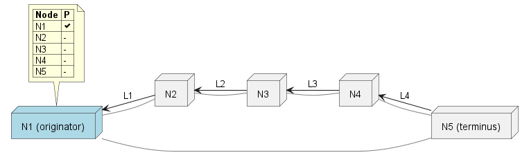
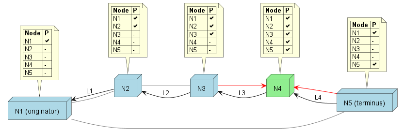
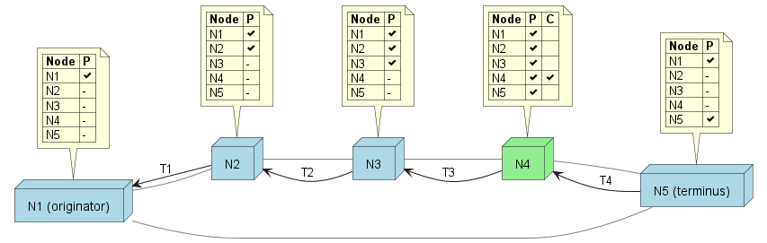
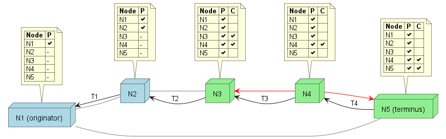
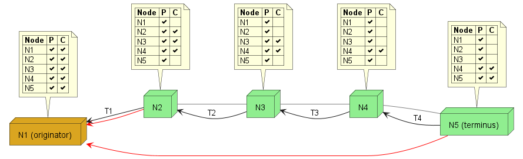

# Distributed Transactions

## Ring voting consensus algorithm

The goal of this algorithm is to affect a transaction and have all nodes eventually converge on the result, and to do this with good performance in the normal case.  The algorithm consists of the following elements:
* Originator - the node instigating the transaction
* Terminus - the node on the receiving end of the transaction
* Participant - a node that is participating in the chain, and includes the originator to terminus
* Relay - a non participating node acting solely as a communications path
* Referee - a node which votes on the commitment of the transaction.  Any of the nodes may also be a referee, and a referee may be none of those types (orthogonal).

Other terms:
* Plan - a description of the toplogy of the transaction and the relationahip between those elements
* Record - A data structure containing the transaction's terms, it's plan, and signature state

## Phases

1. Discovery – Find at least one route between originator and terminus:
   * a chain of participants from originator to terminus
   * if the originator and terminus aren't the same: at least one relay route or direct connection to form the ring.  A relay route if neither the originator or terminus discluses their phyical address; a direct connection if one or both does.

2. Promise – An all-or-nothing decision by the participants to join the transaction.  This entails affixing a digital signature of the plan and terms.  Each promise signature is independant of the others and may be added in any order.

3. Commit - One or more referee nodes vote to commit, or after a timeout, void the fully promised transaction.  A majority of commit or void votes constitutes a tentative consensus, and will be honored by all nodes who receive such a record

4. Consensus - dissemenation of commitment record information between referees and back to participants.  Agreement is rule based; the record itself represents the final status of the transaction.
	
## Discovery Phase

Proceeds as documented in linear or bidirectional discovery.

* Proposed node toplogy is spelled out explicitly by the end.  Participant nodes can change the proposed plan, such as adding referees, and propose different terms, such as including fees or a decreased transaction amount.

* The plan must include a public key for each participant and referee, in order for all nodes to be able to verify the authenticity of others' signatures.  These keys can be generated unique for the transaction.

* Verify a reasonable time sync during discovery communication.  Measure delay time in both directions.
    
    * If out of sync, begin async update of own clock via 3rd party of self-choosing e.g. NIST

## Promise Phase

All participants agree to the terms and allocate their resources.  Agreement is in the form of a digital signature of the plan and terms, at which point changes are locked in.  All nodes can validate a given participant's signature using its public key.

* Originator validates and adds own promise signature and sends in both directions
  * Each participant also adds own promise and forwards

* Each participant validates the record, including
	* The terms and structure of the record remain acceptable
	* The links in the plan and the target pass any reputation rules that might exist
	* The referee(s) are acceptable within configured parameters
	* Possibly check that any directly reachable referee(s) are reachable and share time sync

* If a participant gets promises from both directions, will have all promise votes.  This is the convergence node, and the promise phase is complete

* If a participant receives incomplete promises, and the timeout is past before signing and forwarding, shouldn't promise; add "pre-promise void" (PPV) signature instead and send in both directions.

## Commit Phase

During the commit phase, the referee(s) are given completely promised records and vote to commit or void.

* The convergence node sends the fully promised record to all reachable participants and referees.  If the convergence node is also a referee, it first adds it's own commit signature.

* When a participant receives a record that in't fully consensed, it forwards it to any directly reachable participants and referees which may not already have the record.

* If the participant are also the referees, the record will converges from both directions on a convergence node.  This node will be fully consensed, but will echo the record in both directions.

* If can't send the record to a peer:

    * If opposing peer doesn't have your commit or void, "bounce" it back to them

    * If node on other end of unresponsive peer not in your record, but is a referee, attempt to discover communications route to them

        * If reached, send record

        * Can't reach or another timeout, try next node in ring (if not in record) and repeat

* A participant that has promised, but not been reached, should attempt to reach out to any directly reachable participants and referees if the commit time has elapsed

## Consensus Phase

A record committed by a configured majority of referees (some ratio above 50%) is considered a consensus record.  During the consensus phase, consensus records are propagated between parties.
  
* A participant or referee should receive merge, and relay records to any reachable participant or referee.

* Once a participant possesses a consensus record, it can treat the transaction as fully committed or voided and respectively release or rollback resources.

## Node-level protocol
	
* If receive record from a peer, decide if it has new information and pass it on appropriately

    * If a record has a majority of votes for a PPV, commit or void, majority wins, support it

    * Otherwise, if after timeout add PPV/void, commit if before

* If you're a node which has been out of communication, and you come back online, if you have signed anything that would now be timed out, reach out to both peers for an update.

* If a broken, minority ring segment hits a timeout with no progress from ends trying to establish a route around, the second to end nodes should begin trying to route around, etc.

* Timeouts should all be synchronized, but use time doubling or some such to avoid thrashing

* Verify every peer message, including:

    * time sync
    * correct signatures
    * signed content matches signatures
    * not void before timeout
    * not signed both void and commit/promise
    * the link through which a record is received matches the plan
    
    If incorrect, don't accept update; reply with problem, flag for reputation, and notify opposite peer

## Extra votes

In order for nodes to gain more assurance of liveness, during the discovery process, a node can indicate as part of accepted terms, that in order to participate in the transaction it requires being able to give additional peer voters.

Nodes can observe these terms of other involved nodes as sell when a match propagates back towards the originator, and can update their acceptable terms as well in response, but a deeper node will have to wait until the next phase to see the complete plan.

## Exceptions

### Dead referees

If a majority of referees go offline indefinitely, the participants are stuck with locked resources.  Note that this requires *all* of said majority referees to not be reachable through *any* potential path from any of the participants, in perpetuity; which essentially means they are forever lost from the network.  If even a single participant is able to reach a given referee, it will share the received record with the others.

### Lying referees

Referee may intentionally or unintentionally "lie" and give out contradictory votes.  In the worst case, where said referee is also a tie breaker voting wise, this can cause a situation where some participants commit their resources, while others roll them back.  This will be discovered during Concensus, and each participant can take action based on what is most adventageous.  For instance:
* a participant that was told to void, which is downstream of nodes which committed, may choose to remain in a voided state, but may elect to participate in a subsequent correcting lift
* a participant that was told to commit, which is downstream of nodes which voided, may create a compensating reversal transaction with its peers

### Potential problems during Promise

One or more nodes exhibits a:

* loss of connection in one direction
* loss of connection in both directions, or goes offline
* clock jump forward – intentional or unintentional
* clock jump backward – intentional or unintentional
* void signing before timeout
* both void and commit signed and sent
* change of signed content
* invalid change of terms before signing
* too many excess votes

## Performance considerations

* Because propagation happens in both directions around the ring, the algorithm may only take as much time as a single message would take to traverse ONE WAY down the chain in the best case
* Some of the operations can be undertaken simultaneously
